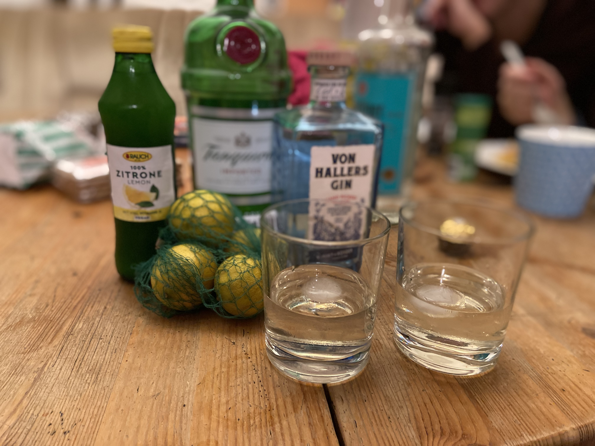

# Gimlet

\#gin #cocktail

**4cl Gin**
**2 cl Rose's Lime Juice**

Gin und Lime Juice mit Eiswürfeln im Rührglas gut vermischen, in ein Cocktailglas abgießen und mit einer Limettenscheibe garnieren. Das Verhältnis von Gin und Lime Juice kann man nach Geschmack verändern. Statt mit Gin lässt sich der Gimlet auch mit Wodka mixen.

