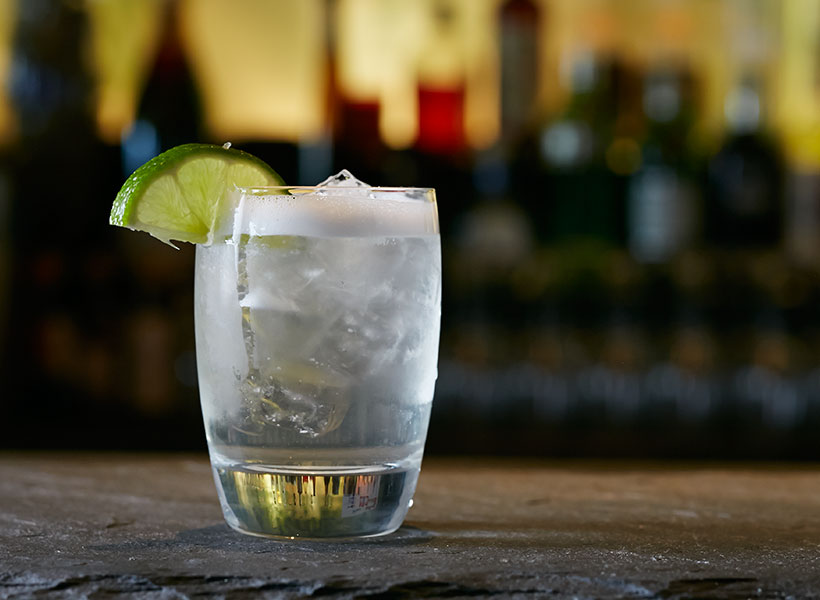

# Vodka Fizz

\#vodka #cocktail

**5 cl Vodka**
**3 cl Zitronensaft**
**2 cl Zuckersirup**
**kaltes Sodawasser**

Die Zutaten - ohne Sodawasser - mit Eiswürfeln im Shaker lange und kräftig schütteln. In ein Longdrinkglas abgießen und mit etwas Sodawasser auffüllen.

