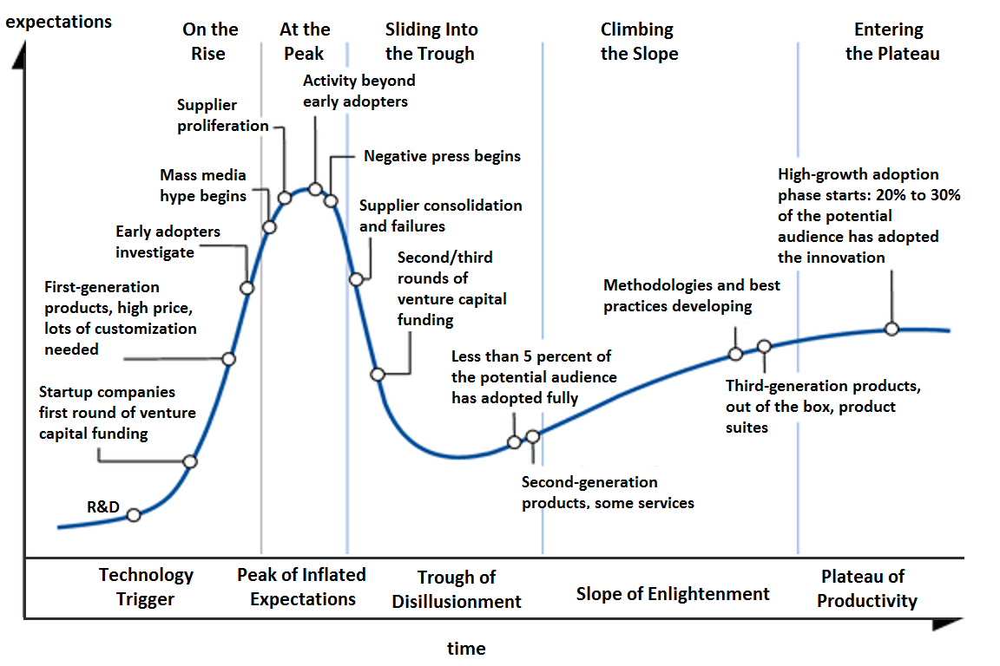

# Gartner Hypecycle

The Gartner hype cycle is a graphical presentation developed, used and branded by the American research, advisory and information technology firm Gartner to represent the maturity, adoption, and social application of specific technologies. The hype cycle claims to provide a graphical and conceptual presentation of the maturity of emerging technologies through five phases. The model is not perfect and research so far shows possible improvements for the model.

